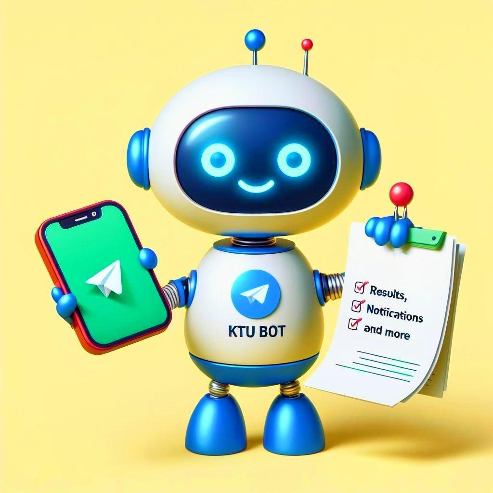

<h1 align="center"> KTU Bot ⚡ </h1>

<p align="center">
   
</p>

<p align="center">
<strong>A battle-tested, fully open source & libre Telegram bot that served 30,000+ users/month at its peak</strong><br/>
Fast lookups • Full-text search • Smart announcement subscriptions • Real-time notifications<br/>
Everything the official website should've been, but isn't.
</p>

<p align="center"><em>No ads. No tracking. 100% libre and will always remain so.</em></p>

<p align="center">
   <a href="https://ktu-bot-status.betteruptime.com/">
      
   </a>
</p>

---

> [!IMPORTANT]
> This bot just got a **major rewrite**. This branch (`grammy-rewrite`) contains the new architecture built on [GrammY](https://grammy.dev/). The legacy implementation lives in the `prod` branch.
>
> **Read the story:** [Why I rewrote this entire thing](./docs/rewrite.md)

> [!NOTE]
> This project is currently in **autopilot/maintenance mode**. Core functionality depends on public KTU endpoints that can change without notice. If you want to help maintain, extend, or fork it — you're more than welcome. ❤️

---

## What Is This? 🤔

KTU Bot is a Telegram bot that helps students do everything they could (and should) do on the official KTU website — check announcements, timetables, academic calendars, results, and more. The official site is notoriously clunky and frequently crashes when you actually need it, so this bot **taps into their public APIs** to deliver a reliable experience the website can't.

What started as a quick 50-line script to check my own results eventually became a lifeline for tens of thousands of students. It turned into the default go-to during results season, sparked a wave of similar tools, and carved out its own identity.

### What You Can Do

- 🔍 **Full-text search** across announcements, academic calendars, and exam timetables — find what you need right from the chat
- 📂 **Browse historical data** — announcements, exam timetables, academic calendars, all in one place
- ⚡ **Smart subscriptions** — get only the announcements that matter to you using filters (course, type), delivered the moment they arrive
- 📊 **Results lookup** _(currently broken, not the bot's fault — [read why](./docs/rewrite.md#results-not-working-))_

> [!TIP]
> Check out the [Commonly Asked Questions](./docs/rewrite.md#commonly-asked-questions-) for answers to common questions like "Why isn't results working?" and "Will the bot keep working?"

## Architecture Overview 🏗️

The bot follows a microservices architecture where each component handles a specific responsibility. If one service fails, others keep running.

| Component                       | Type                | What It Does                                                                                  |
| ------------------------------- | ------------------- | --------------------------------------------------------------------------------------------- |
| **Bot**                         | GrammY Telegram bot | Handles all user interactions — commands, searches, conversations                             |
| **Announcements Notify Worker** | Background worker   | Monitors for new announcements using BullMQ scheduled jobs and sends filtered alerts to users |
| **Broadcasts Worker**           | Background worker   | Handles queued broadcast message delivery                                                     |
| **Data Sync Worker**            | Background worker   | Periodically syncs KTU data to local DB via BullMQ scheduled jobs to power full-text search   |
| **Bull Board Service**          | Monitoring service  | Web dashboard for real-time queue monitoring and job management                               |
| **PostgreSQL**                  | Database            | Stores all data with Drizzle ORM for type-safe queries                                        |
| **Redis**                       | Queue               | Powers BullMQ jobs                                                                            |

> [!TIP]
> **Want to understand how it all works?** Check out [How It Works](./docs/working.md) for the complete architecture breakdown with diagrams.

## Quick Start 🚀

### Prerequisites

- [Docker](https://docs.docker.com/get-docker/) + [Docker Compose](https://docs.docker.com/compose/install/)
- [Node.js](https://nodejs.org/) (if running locally) — this project uses `pnpm`
- A Telegram bot token from [@BotFather](https://t.me/botfather)

> Trust me. Docker is the easiest way to run anything within seconds 🙃

### 1. Clone the Repo

```bash
git clone https://github.com/devadathanmb/ktu-bot.git
cd ktu-bot
```

### 2. Configure Environment

Development environment files live in the `dev/` directory. Each service/module has its own `.env` file.

**Minimum required:**

- `dev/bot.env` — Set `BOT_TOKEN` and `BOT_FILE_UPLOAD_CHANNEL_ID`
- Most files come prefilled with sensible defaults

**Optional (for extra features):**

- `dev/api.env` — For UptimeRobot monitoring, file uploads, etc.
- `dev/llm.env` — For AI-powered announcement filtering

> [!NOTE]
> Most environment variables needed for the development setup come pre-configured in each `.env` file.
>
> However, some configurations depend on external services and are left as placeholder values. Fill those in with actual credentials if you plan to use those features.

> [!IMPORTANT]
> **For sensitive local secrets:**
>
> ```bash
> cp .env.dev.example .env.dev
> # Add your personal API keys, tokens, or credentials here
> ```
>
> This file is mounted **last** in Docker Compose, so values here override anything in `dev/*.env` files.

> [!WARNING]
> If you don't configure certain `.env` variables, those features simply won't work or the [zod validations](https://zod.dev/) may get triggered. Review each file to see what's needed.

### 3. Run Everything

```bash
docker compose -f docker-compose.dev.yaml down -v --remove-orphans && \
docker compose -f docker-compose.dev.yaml up --build
```

This starts all services with hot-reload enabled. Code changes trigger automatic restarts.

### 4. Run Only the Bot

If you don't need the workers:

```bash
docker compose -f docker-compose.dev.yaml up ktu-bot-app --build
```

> [!TIP]
> Database migrations are generated and run automatically via the `ktu-bot-db-migrations` service.
>
> Once everything is up, talk to your bot in Telegram!

### 5. Run Individual Workers

Need just the notification worker? No problem:

```bash
# Announcements notify worker
docker compose -f docker-compose.dev.yaml up announcements-notify-worker --build

# Data sync worker
docker compose -f docker-compose.dev.yaml up data-sync-worker --build

# Broadcasts worker
docker compose -f docker-compose.dev.yaml up broadcasts-worker --build
```

> [!TIP]
> Each service exposes a health check endpoint (e.g., `http://localhost:3000/health`)
>
> There's also a dedicated `bull-board-service` running on port `3010` that provides a Bull Board UI for monitoring background workers and queues. Access it at `http://localhost:3010`

## Production Deployment 🏭

Production uses a single `.env` file approach for simplicity.

### 1. Configure Environment

```bash
cp .env.prod.example .env
# Edit .env and fill in all required values
# Most values come pre-configured — just update anything specific to your deployment.
```

### 2. Start Services

```bash
docker compose down -v --remove-orphans && \
docker compose up -d --build
```

### 3. Verify Health

```bash
curl -f http://localhost:3000/health
```

### Notes

- All services communicate over an internal Docker network
- Database migrations run automatically on startup
- Make sure all required API keys/tokens are provided
- If some keys are missing, update the code to handle their absence gracefully

## Tech Stack 🛠️

- **Language:** [TypeScript](https://www.typescriptlang.org/) — Because type-safe code is always better?
- **Bot Framework:** [GrammY](https://grammy.dev/) — Modern, type-safe Telegram bot framework
- **Database:** [PostgreSQL](https://www.postgresql.org/) — Powerful relational DB with god knows how many features
- **ORM:** [Drizzle](https://orm.drizzle.team/) — Type-safe SQL queries and migrations
- **Job Queue:** [BullMQ](https://docs.bullmq.io/) — Reliable background job processing
- **HTTP Client:** [got](https://github.com/sindresorhus/got) — Modern fetch wrapper

## Contributing 🤝

Contributions are welcome! Whether it's bug fixes, new features, documentation improvements, or ideas — all are appreciated.

> [!TIP]
> **Need help getting started?** Check out [How It Works](./docs/working.md) to understand the architecture.

> [!TIP]
> **New to Telegram Bot ecosystem?** Check out this [awesome getting started guide](https://grammy.dev/guide/getting-started) from GrammY.

## Bugs & Feedback 🐛

Found a bug? Have an idea? Want to discuss something?

**Open an issue:** https://github.com/devadathanmb/ktu-bot/issues

When reporting bugs, please try to include:

- What you were trying to do?
- What happened instead?
- Steps to reproduce (if reproducible)

---

## Documentation 📚

- **[How It Works](./docs/working.md)** — Complete architecture breakdown with diagrams
- **[The Rewrite Story](./docs/rewrite.md)** — Why I rewrote this and some commonly asked questions

## License 🛡️

**GPL-3.0** — See [LICENSE](./LICENSE.md) for details.

This means you can use, modify, and distribute this code freely, but you must:

- Keep it open source
- Share your changes under the same license
- Give credit where it's due
