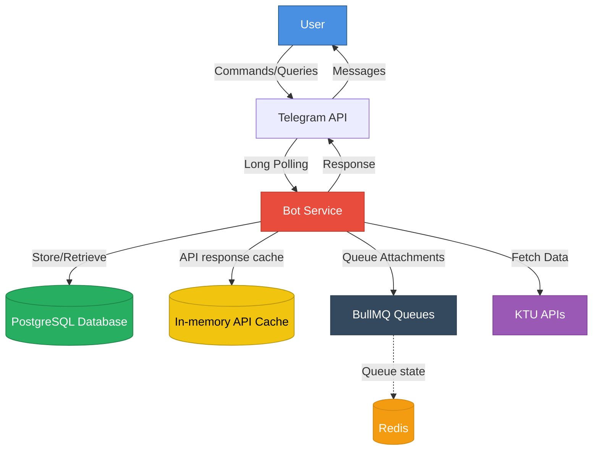
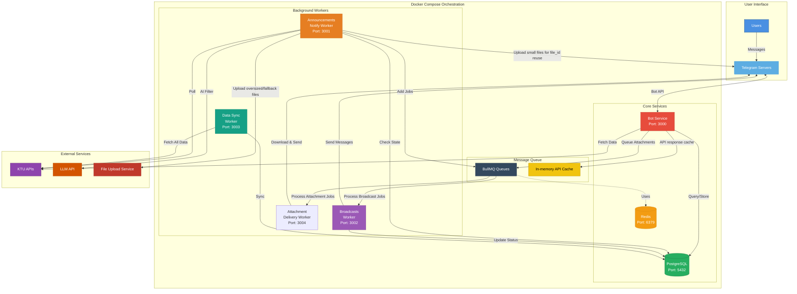

# How KTU Bot Works

This document explains the system architecture: what each service does and how they fit together. For setup instructions, see the [README](../README.md).

## The Short Version

KTU's website fetches its data from public HTTP APIs. This bot uses those same APIs directly and adds what the site lacks: fast search, subscriptions, and notifications. Anything KTU stops exposing publicly (like results after early 2025) is out of the bot's reach too.

## Architecture Overview

> [!NOTE]
> Diagrams below show users talking to the bot directly for simplicity. In reality everything flows through Telegram's servers.

The system runs as independent services that communicate through a job queue and a database. If one worker crashes, the bot keeps serving users.

## Core Components

Everything is orchestrated with Docker Compose. Compose files live under `docker/compose/` (dev, staging, production). One command starts the bot, workers, PostgreSQL, and Redis on a shared network.

### Bot Service

The main service users talk to: commands, inline queries, searches, and multi-step lookups. Built on [GrammY](https://grammy.dev/), organized as one composer per feature.

Supported lookups: syllabus (program → scheme → branch → syllabus), exam timetables, academic calendars, and announcements. Timetable, calendar, and announcement pages render API results as received; syllabus pagination reuses data already held in the session. File downloads are queued to the attachment-delivery worker so the bot never blocks on a download, and syllabus download buttons keep the original API-response indices so the right file is queued after filtering.

### API Layer and Caching

All KTU calls go through a shared Got client with two variants:

- **`cachedApiClient`** (default): in-memory LRU cache keyed by URL + request body. Default TTL 5 minutes; 1 hour for programs/schemes/branches/syllabus, 30 seconds for announcements, 5 minutes for timetables and academic calendars. Only 200 responses are cached.
- **`baseApiClient`** (uncached): used by workers that need fresh data (data sync, notification checks).

Excluded from caching: attachment endpoints (`/getAttachments`, `/getAttachment`, large base64 payloads) and the reCAPTCHA probe (`/get?key=v3`).

KTU also requires a single-use Cloudflare Turnstile `X-Token` on each request. The token hook runs after the cache hook, so cache hits never mint a token and each uncached request mints exactly one. Solver failures (timeout, network error, non-2xx, malformed JSON, blank token) fail the request instead of sending it without a token.

### PostgreSQL Database

Permanent storage for subscription preferences, synced announcements/timetables/calendars, and chat metadata. Schema is defined with [Drizzle ORM](https://orm.drizzle.team/). PostgreSQL's built-in full-text search powers inline search. Queries hit the local copy, not KTU's APIs.

### Redis and BullMQ

[Redis](https://redis.io/) backs [BullMQ](https://docs.bullmq.io/), the job system connecting the services. Producers (bot, notify worker, data-sync worker) drop jobs into queues; consumers (broadcast, attachment-delivery, data-sync workers) pick them up. If a consumer is down, jobs wait in the queue until it recovers.

## Background Workers

Workers handle slow or periodic work so the bot stays responsive. Recurring jobs use BullMQ job schedulers with stable IDs, so changing a schedule updates the existing entry instead of creating duplicates.

### Announcements Notify Worker

Polls KTU every few minutes (every 2 in production, every minute in dev), diffs against the local buffer, and notifies subscribers about new items:

1. Fetch latest announcements with the uncached client
2. Compare against the stored buffer to find new ones
3. Extract course filters per announcement; fall back to the LLM relevance check when filters are missing or unclear
4. Pre-process attachments: small files go to a dedicated Telegram channel for a reusable `file_id`; oversized or failed uploads go to a temporary file host as links
5. Enqueue one broadcast job per matching subscriber, then update the buffer

Broadcasts are always enqueued before the buffer is replaced, so a crash between the two re-sends rather than silently dropping notifications.

### Broadcasts Worker

Delivers queued messages, one at a time (`concurrency: 1`; Telegram's limits are undocumented, so sequential sending is the safe choice). On `retry_after`, it pauses the whole queue for the requested duration and lets BullMQ retry the job.

### Data Sync Worker

KTU's APIs have no text search, so this worker maintains the local searchable copy. It runs a full sync on first startup (when the database is empty), then re-syncs on a 30-minute schedule. Records are upserted, so re-runs are safe; inline search reads this copy via PostgreSQL full-text search.

### Attachment Delivery Worker

Sends requested files without blocking the bot:

1. The bot queues the request and immediately replies with a status message
2. The worker downloads every attachment first. If any download fails, nothing is sent (all-or-nothing, no partial sets)
3. Files go out as Telegram documents, the first with a caption listing all attachment names; files over Telegram's size limit go to the temporary file host as links
4. The status message is deleted on completion, and chats that blocked the bot or deactivated are cleaned up

Runs at `concurrency: 2` to stay under Telegram's rate limits.

## Health Checks and Monitoring

Every service exposes `/health` (bot `3000`, workers `3001`–`3004`, Bull Board `3010`). Worker checks cover the service itself plus its queue and database connectivity.

- **Bull Board** (`http://localhost:3010`): real-time view of all queues: job states, retries, failures.
- **Prometheus** (optional): the bot exposes app metrics when `ENABLE_PROMETHEUS_METRICS=true` (default `false`); workers always expose BullMQ queue metrics on their monitoring ports. `docker/monitoring/compose.yaml` runs a standalone Prometheus on port `9090` with remote-write credentials from `env/prod/prometheus.env`.
