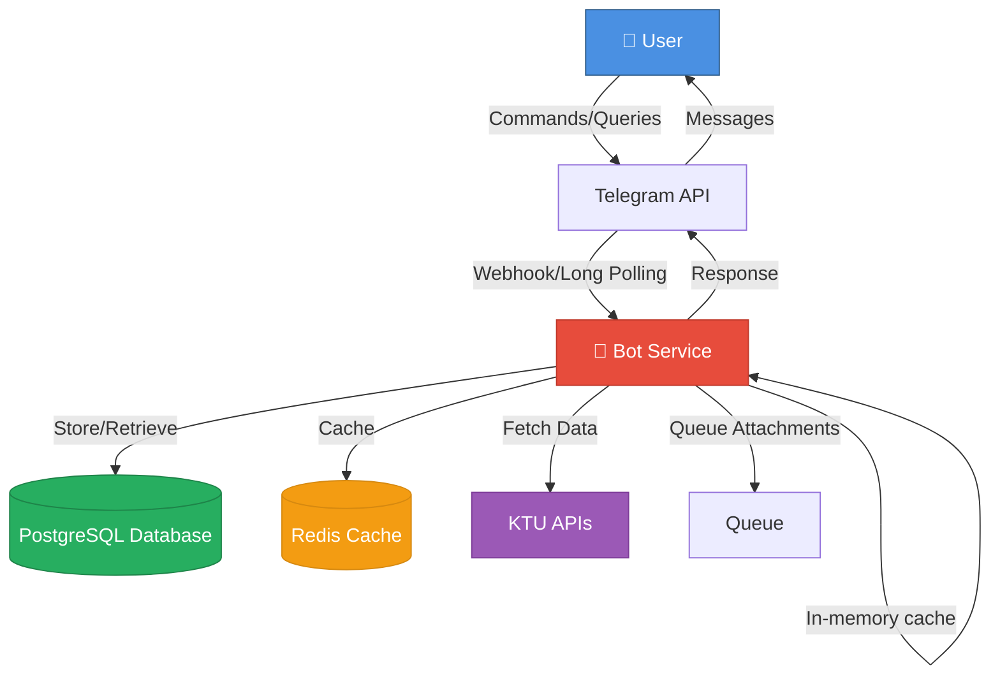
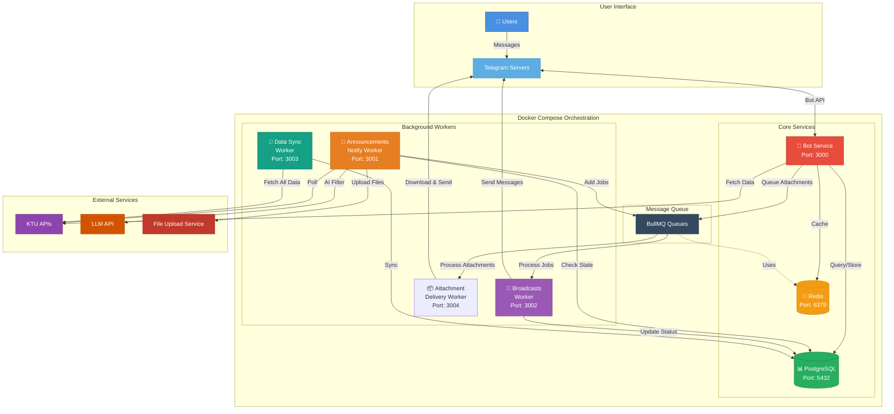

# How KTU Bot Works?

This document provides a high-level overview of how the entire system works. The goal is to help anyone understand the core architecture, whether you want to contribute, fork the project, or are just curious about how it all comes together.

## This Isn't Magic

Before we dive in, let's clear something up. If you don't have much technical background, you might wonder how this bot pulls data from KTU and sends you announcements as they arrive, or _"How is it able to find my results?"_ _"Is it safe?"_ I know you may have a lot of such questions, and I've received plenty of them from users in the past.

Here's the thing: **this isn't magic**. The bot is just a smart [API consumer](https://medium.com/@kumarnagendra205/mcpa-part-1-api-terminology-api-api-client-api-consumer-and-api-implementation-61165dbd81b3). An API is basically an interface to access data - think of it like a waiter at a restaurant. You tell the waiter what you want, they go to the kitchen, and bring back your order. KTU's website actually uses their own APIs to fetch and display data in the UI. Since this project isn't officially associated with KTU, it uses those same public APIs to get the data.

But what makes the bot special is what it does with that data. It applies some clever techniques while fetching and processing it, enabling all the functionality users rely on. In fact, the bot was known for retrieving results even when KTU's website was down - this was possible because their API remained accessible, and the bot employed specific strategies to fetch results when other methods failed.

If you're curious to learn more about how it works under the hood, keep reading. 👇

## Architecture Overview

> [!NOTE]
> In all diagrams below, direct user interaction with the bot is shown for simplicity. In reality, all communication flows through Telegram's servers - users send messages to Telegram, which forwards them to the bot, and responses follow the reverse path.

The bot is built as independent services — each handles a specific responsibility, and they communicate through a job queue and database. This means if one piece fails, it doesn't bring down the entire system. For example, if the notification worker crashes, users can still interact with the bot normally — notifications just won't go out until the worker recovers.

Here's how everything fits together at a high level:

And here's the detailed view showing all the moving pieces:

## Core Components

The entire system is orchestrated using [Docker Compose](https://docs.docker.com/compose/), which lets you define and run all these services together. Compose files are organized under `docker/compose/` (production, staging, dev) and `docker/swarm/` (Docker Swarm deployment). Each service gets its own container and they all communicate over a Docker network. This makes development super easy - one command starts everything up with proper networking and all dependencies configured.

### Bot Service

This is the main service that users interact with. It handles all commands, inline queries, searches, and conversations. The bot is built using [GrammY](https://grammy.dev/), which is a modern TypeScript framework for building Telegram bots. GrammY has a great ecosystem of plugins and excellent documentation, making it really easy and fun to work with.

The bot uses a [composers pattern](https://grammy.dev/plugins/composer.html) to organize different features - each feature gets its own composer that handles related functionality. This keeps the code clean and maintainable. All the core bot logic lives in the `src/bot/` directory. The bot also uses GrammY's plugin ecosystem extensively - for things like auto-retry, rate limiting, hydration, emoji parsing, and more. You can see the full list of plugins in [`package.json`](../package.json) or check how they're wired up in the middleware section of [`src/bot/bot.ts`](../src/bot/bot.ts)

### API Layer and Caching

All KTU API calls go through a shared Got HTTP client in `src/api/client.ts`, which has two variants:

- **`cachedApiClient`** — The default, cached client. Wraps the base client with an in-memory LRU cache via `beforeRequest`/`afterResponse` hooks. Responses are cached by URL + request body hash, with configurable per-endpoint TTLs (e.g., 1 hour for programs/schemes, 5 minutes for announcements). Only 200 responses are cached.
- **`baseApiClient`** — The uncached client. Used by workers that need fresh data (data-sync, notification checks).

Service functions (like `fetchPrograms`, `fetchAnnouncements`) accept an optional `apiClient?: Got` parameter. When omitted, the cached client is used. Workers pass `baseApiClient` when they need fresh data.

The cache configuration lives in `src/api/cache/config.ts`. Attachment endpoints (`/getAttachments`, `/getAttachment`) are excluded from caching because they return large base64 payloads that would bloat memory.

### PostgreSQL Database

The bot needs permanent storage for things like user subscription preferences, cached announcements, exam timetables, academic calendars, and metadata about blocked users. This is where [PostgreSQL](https://www.postgresql.org/) comes in. The bot uses [Drizzle ORM](https://orm.drizzle.team/) for type-safe database operations, with all schema definitions in [`src/db/schema/`](../src/db/schema/)

PostgreSQL isn't just a simple database - it offers powerful features like [full-text search](https://www.postgresql.org/docs/current/textsearch.html), which the bot leverages heavily for its inline search functionality. When you search for something inline, that query hits the bot's database (not KTU's APIs) and uses PostgreSQL's built-in full-text search to find relevant results quickly.

### Redis and BullMQ

[Redis](https://redis.io/) is an in-memory data store that powers [BullMQ](https://docs.bullmq.io/), which is the job queue system that lets different parts of the bot communicate.

Think of BullMQ as a post office for tasks. The announcements worker creates "jobs" (like letters) and drops them into a queue (like a mailbox). The broadcasts worker then picks up these jobs and processes them. This decoupling is crucial - the service that creates jobs doesn't need to know anything about the service that processes them. If the broadcast service is down, jobs just wait in the queue. When it comes back up, it picks up where it left off.

You can read more about the different background workers the bot uses in the below section.

## Background Workers

These are independent services that handle specific tasks in the background. Unlike the main bot that responds to user interactions, workers run on schedules or process queued jobs without direct user involvement. They're crucial because they handle time-consuming or periodic tasks without blocking the bot - if a worker crashes, the bot keeps running, and vice versa. This separation also makes the system more scalable since you can run multiple instances of workers independently.

### Announcements Notify Worker

This worker uses **BullMQ repeatable jobs** to continuously monitor for new announcements. Here's what it does:

1. A recurring BullMQ job runs at the specified interval (configurable, usually every few minutes) to fetch the latest announcements from KTU's API
2. Compares with local state in the database to identify any new announcements that haven't been processed yet
3. Extracts course filters from each new announcement to determine who it's relevant for (like "B.Tech", "MBA", etc.)
   - If filter extraction fails or is unclear, it uses an LLM service to determine if the announcement is actually relevant to students
   - This filters out unwanted trash announcements (which a lot of them are)
4. Handles file attachments by uploading them to a dedicated Telegram channel first to get a `file_id`
   - The bot can then reuse this `file_id` when sending to users instead of downloading and re-uploading hundreds of times
5. Finds matching users by querying the database for users subscribed to the announcement's course filters
6. Creates broadcast jobs with payloads for each user and adds them to the broadcasts queue
   - It doesn't send messages itself, just prepares the jobs
7. Updates the local buffer in the database to mark these announcements as processed

BullMQ automatically handles retries if a job fails (with exponential backoff), making this more resilient than traditional cron. All this logic lives in [`src/workers/announcements/notify/`](../src/workers//announcements/notify/)

### Broadcasts Worker

This is the worker that actually delivers messages to users. It's designed to be generic - it can broadcast anything (announcements, manual admin broadcasts, alerts) as long as the job payload is in the right format. Here's how it works:

1. Monitors the broadcasts queue continuously and picks up jobs as they arrive
2. Sends each message to the user specified in the job payload via Telegram's Bot API
3. Handles rate limiting gracefully - when it hits Telegram's [rate limits](https://core.telegram.org/bots/faq#broadcasting-to-users), Telegram responds with a `retry_after` value
4. Pauses the entire queue for the specified duration (Telegram's limits are intentionally undocumented, so this is the safest approach)
5. Marks the job for retry and resumes processing after the pause period

> [!TIP]
> This worker has a `concurrency` value of `1`, which is intentional!
>
> Since we don't know Telegram's exact rate limits, sending concurrent messages would work fine until it suddenly doesn't. Sequential processing ensures we can properly handle rate limit responses without overwhelming Telegram's servers.
>
> Read more about it here - [Flood Limits](https://grammy.dev/advanced/flood)

The code and the entire logic lives in [`src/workers/broadcasts/`](../src/workers/broadcasts/)

### Data Sync Worker

Here's a frustrating thing about KTU's APIs - their APIs don't expose any text search functionality. You can't search for _"examination results 2025"_ anywhere on their website and get filtered results (this used to be there if I recall correctly but not anymore). It's honestly poor design for such a basic feature, but the bot needs this capability for inline search. The solution? Maintain a local, searchable copy of their data. This worker uses **BullMQ for scheduling** and handles syncing in three separate jobs:

1. **On startup**: Checks if the database needs initial syncing - if yes, performs a full sync by fetching all paginated data from KTU's APIs (announcements, timetables, calendars)
2. **Periodic jobs**: Three individual BullMQ jobs run periodically (once or a few times per day) for each data type:
   - `data-sync:announcements` - Syncs announcement data
   - `data-sync:academic-calendars` - Syncs academic calendar data
   - `data-sync:exam-timetables` - Syncs exam timetable data
3. **Individual retries**: If one sync job fails (e.g., announcements), only that specific job retries with exponential backoff - the others continue normally
4. Uses [upsert operations](https://orm.drizzle.team/docs/insert#on-conflict-do-update) to store/update data in PostgreSQL
   - If a record exists, it updates; if not, it inserts
5. Leverages PostgreSQL's [full-text search](https://www.postgresql.org/docs/current/textsearch.html) which is set up at the schema level
   - Once the data is in, search capabilities are automatically available

When users perform inline searches, their queries hit this local copy instead of KTU's APIs, making searches fast and enabling features KTU's website doesn't even have.

The BullMQ-based approach makes this much more resilient than traditional cron scheduling. Check out [`src/workers/data-sync/`](../src/workers/data-sync/) for the implementation.

### Attachment Delivery Worker

This worker handles file downloads and deliveries asynchronously, preventing the bot from being blocked by large file downloads. When users request attachments (calendars, timetables, announcements), the bot immediately queues the request and returns to serving other users. Here's how it works:

1. **Job Creation**: When a user requests files, the bot creates a job containing all attachment metadata and immediately returns
   - Bot sends a friendly status message like _"⏳ Preparing your calendar... I'll send it shortly!"_
   - The bot doesn't wait for downloads to complete
2. **Background Processing**: The worker picks up jobs from the queue and downloads all attachments
   - Uses **all-or-nothing delivery** - if any file fails to download, nothing is sent to ensure users get complete data
   - Downloads happen asynchronously without blocking other users
3. **Media Group Delivery**: Once all files are ready, sends them as media groups (batches of up to 10 files per Telegram API call)
   - Much faster than individual file delivery
   - Single caption listing all attachment names for clarity
4. **Graceful Error Handling**: Handles various failure scenarios without crashing
   - If user blocks the bot, marks their chat as kicked and removes subscriptions
   - If user deactivates account, cleans up their data from the database
   - If rate limited by Telegram, pauses the entire queue for the specified duration, then resumes processing
5. **Status Updates**: Deletes the loading message once delivery is complete (or on failure)
   - No chat pollution - the status message disappears after completion
   - User receives their files cleanly without extra messages

This worker has a `concurrency` of `2` to prevent overwhelming Telegram's rate limits while still processing requests efficiently. All implementation lives in [`src/workers/attachment-delivery/`](../src/workers/attachment-delivery/)

## Health Checks and Monitoring

Each service exposes a health check endpoint (bot on port `3000`, workers on `3001-3004`) that verifies the service is running and can connect to its dependencies like the database and Redis. This enables zero-downtime deployments and automatic restarts if something goes wrong. The health check utility is in [`src/utils/healthCheck.ts`](../src/utils//healthCheck.ts) if you want to see how it works.

### Queue Monitoring with Bull Board

There's a dedicated [**Bull Board**](https://github.com/felixmosh/bull-board) service running on port `3010` that provides a web dashboard for monitoring all BullMQ queues in real-time. Access it at `http://localhost:3010` to view job states, retry failed jobs, and monitor queue health across all workers.

## Tech Stack

Here's what powers the bot:

- [**TypeScript**](https://www.typescriptlang.org/) - Type-safe JavaScript
- [**GrammY**](https://grammy.dev/) - The Telegram bot framework
- [**PostgreSQL**](https://www.postgresql.org/) - Database with full-text search
- [**Drizzle ORM**](https://orm.drizzle.team/) - Type-safe database queries
- [**BullMQ with Redis**](https://docs.bullmq.io/) - Job queue for background tasks

## Wrapping Up

That's the gist of how everything works! The architecture might seem complex at first, but each piece has a clear purpose. The bot handles user interactions, workers process background tasks, the database stores everything, and the queue system ties it all together. If you want to contribute or have questions, feel free to open an issue.
